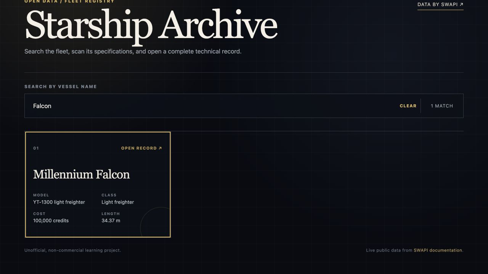
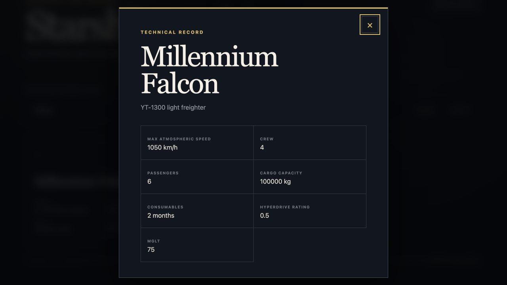

# Star Wars Starships

An accessible React explorer for the public Star Wars starship dataset. Search the full fleet, inspect technical records, and recover gracefully when the upstream service is unavailable.

[Open the live archive](https://sw-starships-react.pages.dev/)



Originally built during week 12 of the Patika Front End Bootcamp, then modernized with an explicit API boundary, current tooling, automated interaction coverage, and a production deployment.

## Features

- Fetches every page of the starship collection from [SWAPI](https://swapi.dev/).
- Instant, case-insensitive name filtering with a live result count and reset states.
- Responsive archive interface built with React and Tailwind CSS.
- Focus-managed detail dialog with Escape support, focus containment, and focus restoration.
- Explicit loading, retryable error, and no-match states.

## Verified behavior

The test suite mocks SWAPI at the application boundary, so CI proves pagination, loading, failed-request retry, filtering, no-match feedback, and keyboard dialog behavior without depending on the public API's uptime.



```sh
npm ci
npm test
npm run lint
npm run build
```

## Data and attribution

The browser fetches read-only public data from `https://swapi.dev/api/starships/`; this repository does not bundle the dataset. SWAPI is a third-party service, so its uptime and response shape remain external dependencies. The application is an unofficial, non-commercial learning project and is not affiliated with Lucasfilm or Disney.

SWAPI describes itself as an open HTTP API with no authentication requirement. See its [documentation](https://swapi.dev/documentation) for the source schema and service limits.

## Earlier iteration

<details>
<summary>Original bootcamp interaction recording</summary>


</details>
